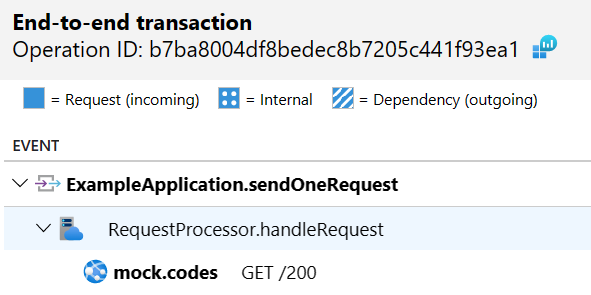

# Manual trace propagation example

To run, from this directory:

```
./mvnw package
export "APPLICATIONINSIGHTS_CONNECTION_STRING=<Copy connection string from Application Insights Resource Overview>"
java -javaagent:target/agent/applicationinsights-agent.jar -jar target/app.jar
```

and then in your browser go to <http://localhost:8080>.

After a couple of minutes, you should be able to see a distributed trace in the end-to-end
transaction details similar to


