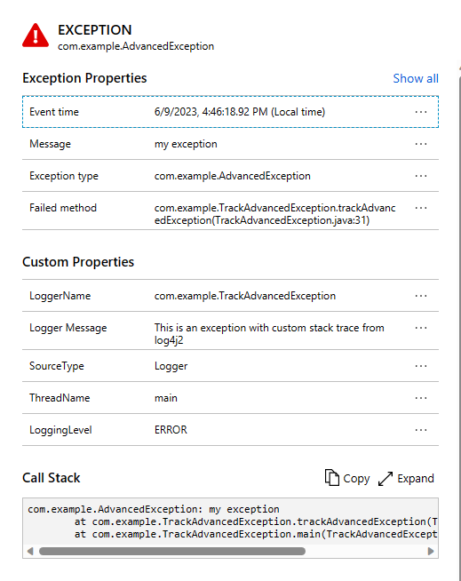

# Track Advanced Exceptions using Azure Monitor OpenTelemetry Exporter

This is a sample app demonstrating how to send exceptions to Application Insights using
[Azure Monitor OpenTelemetry Exporter](https://central.sonatype.com/artifact/com.azure/azure-monitor-opentelemetry-exporter/1.0.0-beta.8).

How to run it:
- Update `CONNECTION_STRING` with your Application Insights resource connection string.
- Run TrackAdvancedException class
- Verify there is a log entry that starts with something as follows:
  `{"ver":1,"name":"Exception","time":`
- After it's finished running, go to Application Insights portal logs blade, query the following:

  ```kusto
  exceptions
  | extend message = tostring(customDimensions.["Logger Message"])
  | where message == 'This is an exception with custom stack trace from log4j2'
  ```

- Go to `Transaction search` -> `End-to-end transaction details`, the advanced exception will look like this:
  