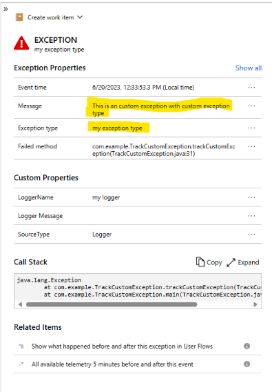

# Track Advanced Exceptions using Java Agent and OpenTelemetry Log Bridge API

This is a sample app demonstrating how to send custom exceptions to Application Insights.

To run, from this directory:

```
../../../mvnw package
export "APPLICATIONINSIGHTS_CONNECTION_STRING=<Copy connection string from Application Insights Resource Overview>"
export APPLICATIONINSIGHTS_SELF_DIAGNOSTICS_LEVEL=debug
java -javaagent:target/agent/applicationinsights-agent.jar -jar target/app.jar
```

Verify there is a log entry that starts with something as follows:
  `{"ver":1,"name":"Exception","time":`

After it's finished running, go to Application Insights portal logs blade, query the following:

  ```kusto
  exceptions
  | where type == 'my exception type'
  | where outerMessage == 'This is an custom exception with custom exception type'
  ```

- Go to `Transaction search` -> `End-to-end transaction details`, the advanced custom exception will look like this:
  